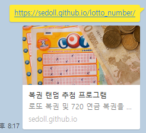

# 로또 번호 추첨기
* 처음에 코딩을 배울 때 만드는 아주 간단한 프로그램이긴 하나 github를 이용해 어느 device에서든지 사용하고 싶어서 제작
* 랜덤 난수를 뽑을 때에는 Math.random()의 경우 예측이 가능하다는 말이 있어서 crypto를 이용해 만들었다.

## 기능

### 로또 번호 추첨
> 1 ~ 45 의 숫자를 랜덤으로 중복없이 6개를 뽑고 오름차순으로 정렬

### 720 연금 복권 추첨
> 1 ~ 5조, 000000 ~ 999999 의 숫자를 랜덤으로 추출

## 결과

### OpenGraph

### Lotto

### 720

## devlop
* HTML, CSS, JavaScript

## img
[OpenGraph](https://pixabay.com/ko/photos/%EA%B2%8C%EC%9E%84-%EA%B0%80%EB%8A%A5%EC%84%B1-1363218/)  
[Favicon](https://pixabay.com/ko/vectors/%EC%95%84%EC%9D%B4%EC%BD%98-%EC%83%81%EC%A7%95-%EA%B8%B0%ED%98%B8-%ED%95%98%EC%96%80%EC%83%89-2141484/)  
